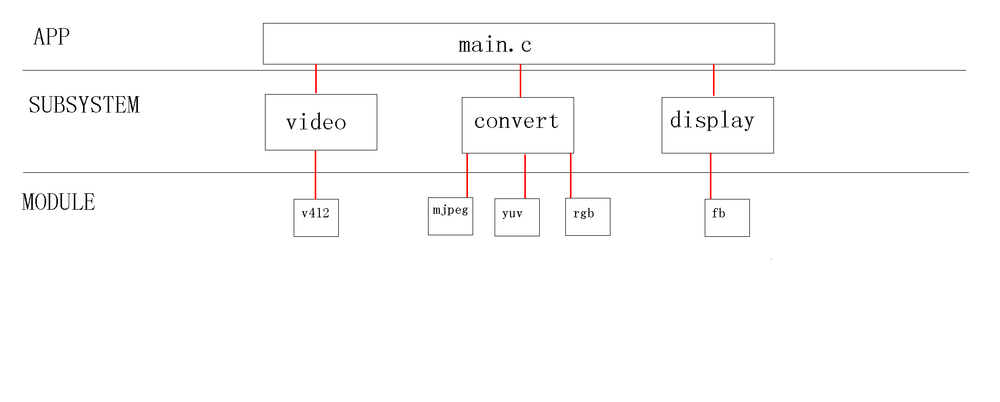

# 写在最前面的话

本项目是韦东山视频监控的复刻版,做了如下改

- 所有链表操作使用和内核一致的接口(完全从Linux内核源代码移植过来的)
- 支持mini2440 sony x35显示屏(添加视频旋转)
- 对原有代码调用做了层次上的限制,不允许在顶层应用调用底层模块,只能使用子系统提供的接口操作

# 编译

直接在顶层目录执行

	make

# 简明架构框图



# 文件说明

main.c 应用模块(最顶层)

klist.h	链表操作的所有宏和函数

display_ss.c 显示子系统

fb_md.c		 显示子模块

convert_ss.c 转换子系统

mjpeg2rgb_md.c 转换子模块

rgb2rgb_md.c   转换子模块

yuv2rgb_md.c   转换子模块

video_ss.c 视频子系统

v4l2_md.c 视频子模块

# skeleton

## Usage

比如要增加一个显示子系统(display)

其中显示子系统里有模块(fb)

subsystem : display_ss.c _ss表示subsystem后缀

module : fb_md.c _md表示module后缀

新建一个子系统

	mkdir display
	cp skeleton/subsystem.c display/display_ss.c
	cp skeleton/module.c display/fb_md.c
	cp skeleton/Makefile display/Makefile
	cp include/SUBSYSTEM_ss.h include/display_ss.h

在vim中将新文件都添加到args中

	:argadd include/display_ss.h display/display_ss.c display/fb_md.c

批量替换

	:argdo! %s/SUBSYSTEM/display/ge | update
	:argdo! %s/MODULE/fb/ge | update

手动修改顶层和子目录Makefile

# make for android

参看Android.mk

# mini2440 x35

通过Makefile中MINI2440_LCD_X35宏来控制编译支持的竖屏X35

```shell
/*
 * 分配两块内存区域用于临时存放视频数据
 * 因为一个像素点用16bpp表示
 * 所以数据类型用short
 * 摄像头采集到的数据是320x240的,放入cam_mem
 * LCD显示器的尺寸是240x320
 * 把cam_mem里的数据放入lcd_mem
 * 最后把lcd_mem放入到framebuffer
 */

/*
 *
 * cam_mem---->	-----------320------------>x
 * 				|         |
 * 				|         |
 * 				240       |
 * 				|---------p(x, y)
 * 				|
 * 				V
 * 				y
 */

/*
 *
 * lcd_mem---->	------240----->x
 * 				|    |
 * 				|    |
 * 				|----p(y, 320 - x)
 * 				|
 * 				320
 * 				|
 * 				|
 * 				|
 * 				|
 * 				V
 * 				y
 */
```
